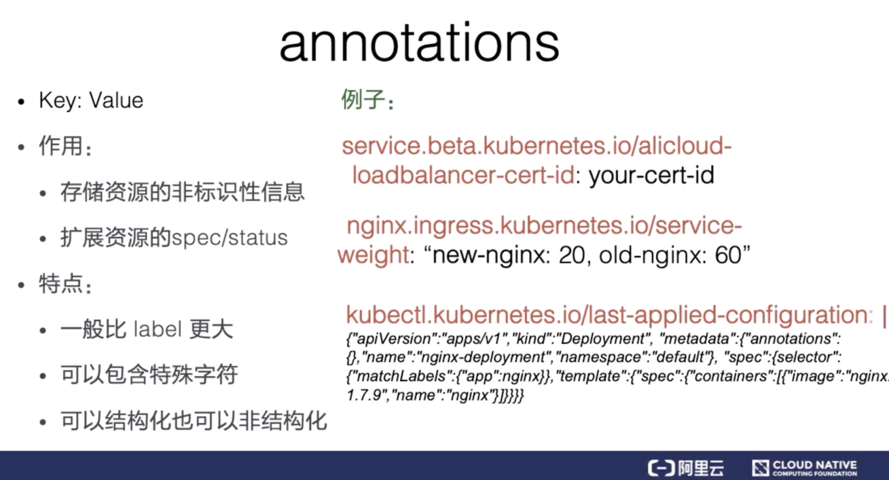
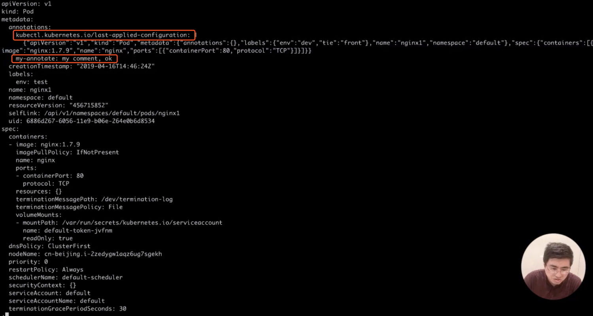
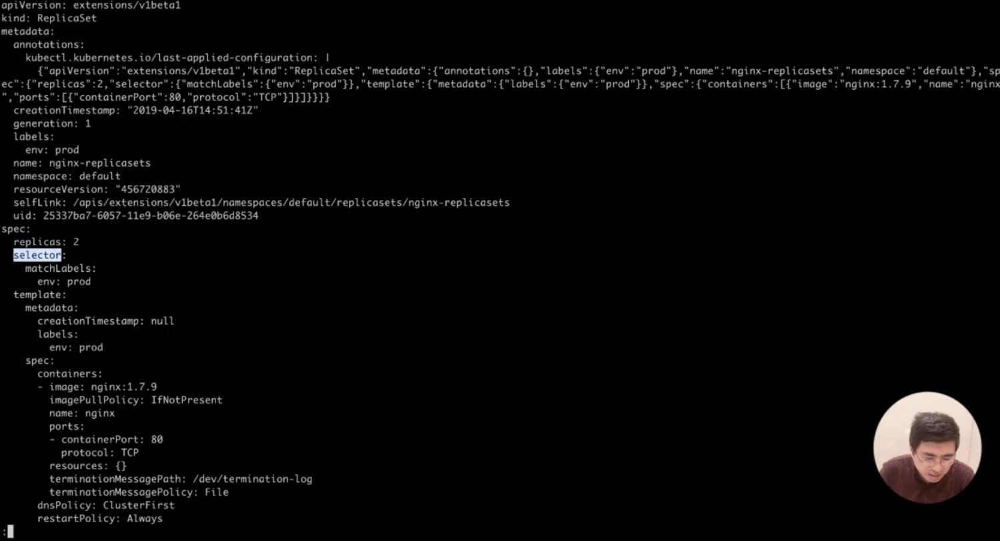
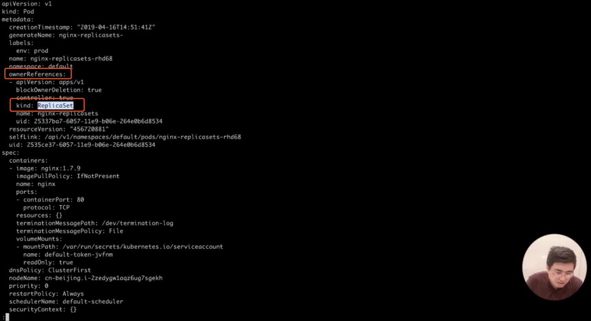
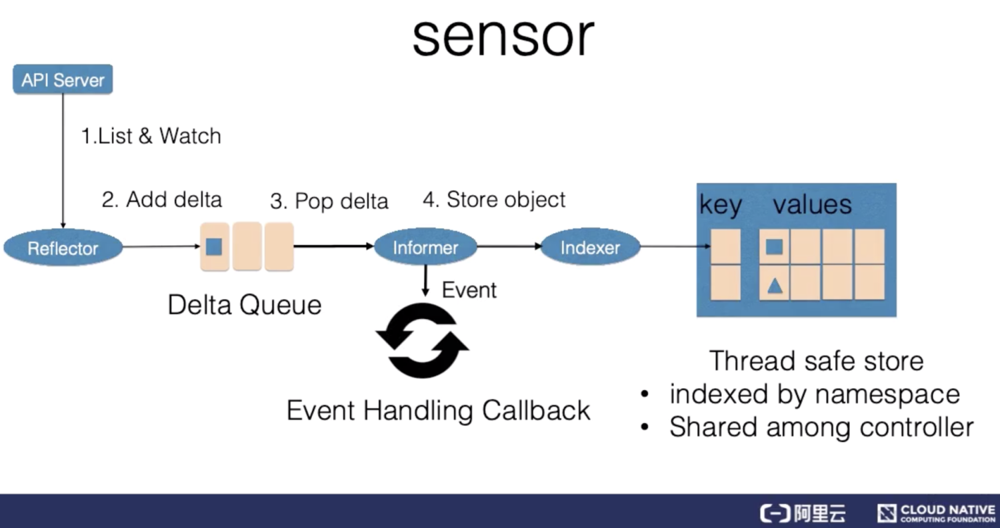
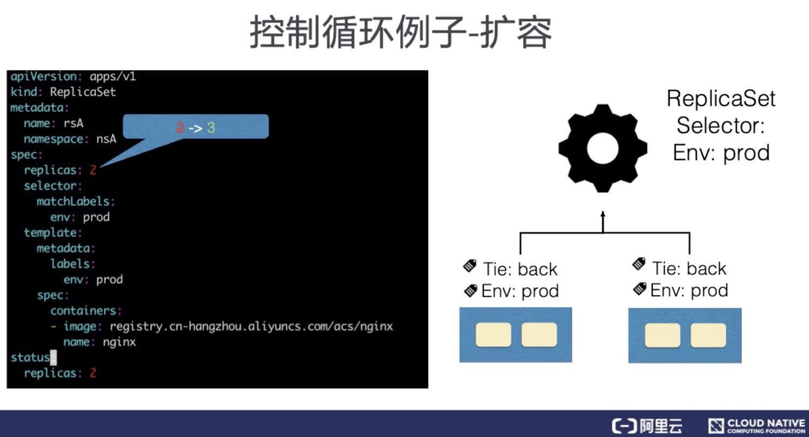
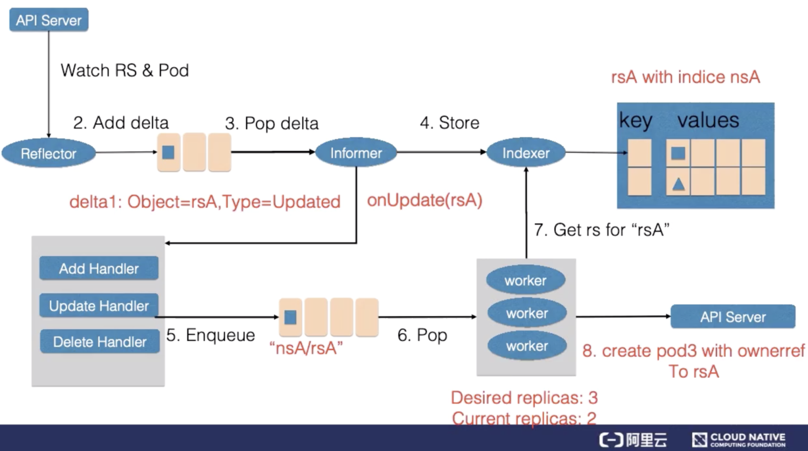
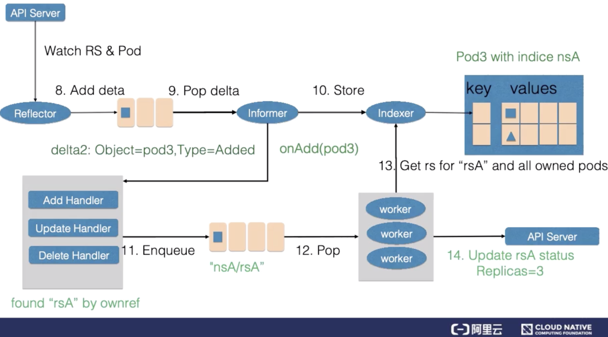
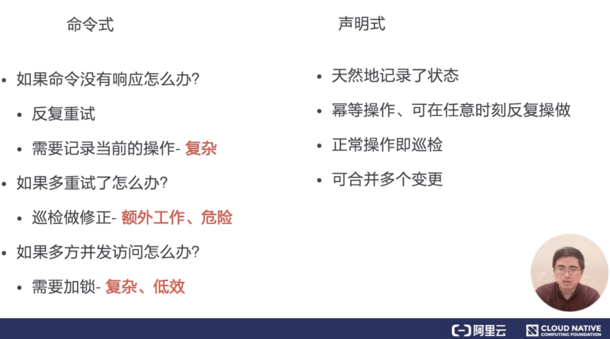
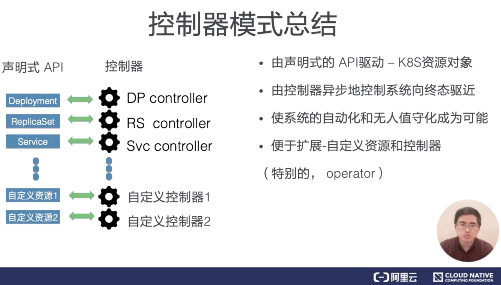

本文将主要分享以下四方面的内容：

1. K8s 资源的重要元信息；
2. 使用阿里云服务演示一下如何去修改或查看 K8s 重要元数据；
3. 详细分析控制器模式；
4. 总结控制器模式特点。

 

## 一、资源元信息

 

### 1. Kubernetes 资源对象

 

首先，我们来回顾一下 Kubernetes 的资源对象组成：主要包括了 Spec、Status 两部分。其中 Spec 部分用来描述期望的状态，Status 部分用来描述观测到的状态。

 

今天我们将为大家介绍 K8s 的另外一个部分，即元数据部分。该部分主要包括了用来识别资源的标签：Labels， 用来描述资源的注解；Annotations， 用来描述多个资源之间相互关系的 OwnerReference。这些元数据在 K8s 运行中有非常重要的作用。后续课程中将会反复讲到。

 

### 2. labels

 

第一个元数据，也是最重要的一个元数据是：资源标签。资源标签是一种具有标识型的 Key：Value 元数据，这里展示了几个常见的标签。

 

前三个标签都打在了 Pod 对象上，分别标识了对应的应用环境、发布的成熟度和应用的版本。从应用标签的例子可以看到，标签的名字包括了一个域名的前缀，用来描述打标签的系统和工具， 最后一个标签打在 Node 对象上，还在域名前增加了版本的标识 beta 字符串。

 

标签主要用来筛选资源和组合资源，可以使用类似于 SQL 查询 select，来根据 Label 查询相关的资源。

 

### 3. Selector

 

最常见的 Selector 就是相等型 Selector。现在举一个简单的例子：

 

假设系统中有四个 Pod，每个 Pod 都有标识系统层级和环境的标签，我们通过 Tie：front 这个标签，可以匹配左边栏的 Pod，相等型 Selector 还可以包括多个相等条件，多个相等条件之间是逻辑”与“的关系。

 

在刚才的例子中，通过 Tie=front,Env=dev 的Selector，我们可以筛选出所有 Tie=front，而且 Env=dev 的 Pod，也就是下图中左上角的 Pod。另外一种 Selector 是集合型 Selector，在例子中，Selector 筛选所有环境是 test 或者 gray 的 Pod。

 

除了 in 的集合操作外，还有 notin 集合操作，比如 tie notin（front,back），将会筛选所有 tie 不是 front 且不是 back 的 Pod。另外，也可以根据是否存在某 lable 的筛选，如：Selector release，筛选所有带 release 标签的 Pod。集合型和相等型的 Selector，也可以用“，”来连接，同样的标识逻辑”与“的关系。

 

 

### 4. Annotations

 

另外一种重要的元数据是：annotations。一般是系统或者工具用来存储资源的非标示性信息，可以用来扩展资源的 spec/status 的描述，这里给了几个 annotations 的例子：

 

第一个例子，存储了阿里云负载器的证书 ID，我们可以看到 annotations 一样可以拥有域名的前缀，标注中也可以包含版本信息。第二个 annotation存储了 nginx 接入层的配置信息，我们可以看到 annotations 中包括“，”这样无法出现在 label 中的特殊字符。第三个 annotations 一般可以在 kubectl apply 命令行操作后的资源中看到， annotation 值是一个结构化的数据，实际上是一个 json 串，标记了上一次 kubectl 操作的资源的 json 的描述。

 

 

### 5. Ownereference

 

我们当时讲到最后一个元数据叫做 Ownereference，所谓所有者，一般就是指集合类的资源，比如说 Pod 集合，就有 replicaset、statefulset，这个将在后序的课程中讲到。

 

集合类资源的控制器会创建对应的归属资源。比如：replicaset 控制器在操作中会创建 Pod，被创建 Pod 的 Ownereference 就指向了创建 Pod 的 replicaset，Ownereference 使得用户可以方便地查找一个创建资源的对象，另外，还可以用来实现级联删除的效果。

 

## 二、操作演示

 

这里通过 kubectl 命令去连接我们 ACK 中已经创建好的一个 K8s 集群，然后来展示一下怎么查看和修改 K8s 对象中的元数据，主要就是 Pod 的一个标签、注解，还有对应的 Ownerference。

 

首先我们看一下集群里现在的配置情况：

 

1. 查看 Pod，现在没有任何的一个 Pod；

 

- **kubectl get pods**

 

1. 然后用事先准备好的一个 Pod 的 yaml，创建一个 Pod 出来；

 

- **kubectl apply -f pod1.yaml**
- **kubectl apply -f pod2.yaml**

 

1. 现在查看一下 Pod 打的标签，我们用 --show-labels 这个选项，可以看到这两个 Pod 都打上了一个部署环境和层级的标签；

 

- **kubectl get pods —show-labels**

 

1. 我们也可以通过另外一种方式来查看具体的资源信息。首先查看 nginx1 第一个 Pod 的一个信息，用 -o yaml 的方式输出，可以看到这个 Pod 元数据里面包括了一个 lables 的字段，里面有两个 lable；

 

- **kubectl get pods nginx1 -o yaml | less**

 

1. 现在再想一下，怎么样对 Pod 已有的 lable 进行修改？我们先把它的部署环境，从开发环境改成测试环境，然后指定 Pod 名字，在环境再加上它的一个值 test ，看一下能不能成功。 这里报了一个错误，可以看到，它其实是说现在这个 label 已经有值了；

 

- **kubectl label pods nginx1 env=test**

 

1. 如果想覆盖掉它的话，得额外再加上一个覆盖的选项。加上之后呢，我们应该可以看到这个打标已经成功了；

 

- **kubectl label pods nginx1 env=test —overwrite**

 

1. 我们再看一下现在集群的 lable 设置情况，首先可以看到 nginx1 的确已经加上了一个部署环境 test 标签；

 

- **kubectl get pods —show-labels**

 

1. 如果想要对 Pod 去掉一个标签，也是跟打标签一样的操作，但是 env 后就不是等号了。只加上 label 名字，后面不加等号，改成用减号表示去除 label 的 k:v；

 

- **kubectl label pods nginx tie-**

 

1. 可以看到这个 label，去标已经完全成功；

 

- **kubectl get pods —show-labels**

 

 

1. 下面来看一下配置的 label 值，的确能看到 nginx1 的这个 Pod 少了一个 tie=front 的标签。有了这个 Pod 标签之后，可以看一下怎样用 label Selector 进行匹配？首先 label Selector 是通过 -l 这个选项来进行指定的 ，指定的时候，先试一下用相等型的一个 label 来筛选，所以我们指定的是部署环境等于测试的一个 Pod，我们可以看到能够筛选出一台；

 

- **kubectl get pods —show-labels -l env=test**

 

1. 假如说有多个相等的条件需要指定的，实际上这是一个与的关系，假如说 env 再等于 dev，我们实际上是一个 Pod 都拿不到的；

 

- **kubectl get pods —show-labels -l env=test,env=dev**

 

1. 然后假如说 env=dev，但是 tie=front，我们能够匹配到第二个 Pod，也就是 nginx2；

 

- **kubectl get pods —show-labels -l env=dev,tie=front**

 

1. 我们还可以再试一下怎么样用集合型的 label Selector 来进行筛选。这一次我们还是想要匹配出所有部署环境是 test 或者是 dev 的一个 Pod，所以在这里加上一个引号，然后在括号里面指定所有部署环境的一个集合。这次能把两个创建的 Pod 都筛选出来；

 

- **kubectl get pods —show-labels -l ’env in (dev,test)’**

 

1. 我们再试一下怎样对 Pod 增加一个注解，注解的话，跟打标是一样的操作，但是把 label 命令改成 annotate 命令；然后，一样指定类型和对应的名字。后面就不是加上 label 的 k:v 了，而是加上 annotation 的 k:v。这里我们可以指定一个任意的字符串，比如说加上空格、加上逗号都可以；

 

- **kubectl annotate pods nginx1 my-annotate=‘my annotate,ok’**

 

1. 然后，我们再看一下这个 Pod 的一些元数据，我们这边能够看到这个 Pod 的元数据里面 annotations，这是有一个 my-annotate 这个 Annotations；

 

- **kubectl get pods nging1 -o yaml | less**

 

然后我们这里其实也能够看到有一个 kubectl apply 的时候，kubectl 工具增加了一个 annotation，这也是一个 json 串。

 

 

1. 然后我们再演示一下看 Pod 的 Ownereference 是怎么出来的。原来的 Pod 都是直接通过创建 Pod 这个资源方式来创建的，这次换一种方式来创建：通过创建一个 ReplicaSet 对象来创建 Pod 。首先创建一个 ReplicaSet 对象，这个 ReplicaSet 对象可以具体查看一下；

 

- **kubectl apply -f rs.yaml**
- **kubectl get replicasets  nginx-replicasets -o yaml |less**

 

 

1. 我们可以关注一下这个 ReplicaSet 里面 spec 里面，提到会创建两个 Pod，然后 selector 通过匹配部署环境是 product 生产环境的这个标签来进行匹配。所以我们可以看一下，现在集群中的 Pod 情况；

 

- **kubectl get pods**

 

 

1. 将会发现多了两个 Pod，仔细查看这两个 Pod，可以看到 ReplicaSet 创建出来的 Pod 有一个特点，即它会带有 Ownereference，然后 Ownereference 里面指向了是一个 replicasets 类型，名字就叫做 nginx-replicasets；

 

- **kubectl get pods nginx-replicasets-rhd68 -o yaml | less**

 

 

## 三、控制器模式

 

### 1、控制循环

 

控制型模式最核心的就是控制循环的概念。在控制循环中包括了控制器，被控制的系统，以及能够观测系统的传感器，三个逻辑组件。

 

当然这些组件都是逻辑的，外界通过修改资源 spec 来控制资源，控制器比较资源 spec 和 status，从而计算一个 diff，diff 最后会用来决定执行对系统进行什么样的控制操作，控制操作会使得系统产生新的输出，并被传感器以资源 status 形式上报，控制器的各个组件将都会是独立自主地运行，不断使系统向 spec 表示终态趋近。

 

 

### 2、Sensor

 

控制循环中逻辑的传感器主要由 Reflector、Informer、Indexer 三个组件构成。

 

Reflector 通过 List 和 Watch K8s server 来获取资源的数据。List 用来在 Controller 重启以及 Watch 中断的情况下，进行系统资源的全量更新；而 Watch 则在多次 List 之间进行增量的资源更新；Reflector 在获取新的资源数据后，会在 Delta 队列中塞入一个包括资源对象信息本身以及资源对象事件类型的 Delta 记录，Delta 队列中可以保证同一个对象在队列中仅有一条记录，从而避免 Reflector 重新 List 和 Watch 的时候产生重复的记录。

 

Informer 组件不断地从 Delta 队列中弹出 delta 记录，然后把资源对象交给 indexer，让 indexer 把资源记录在一个缓存中，缓存在默认设置下是用资源的命名空间来做索引的，并且可以被 Controller Manager 或多个 Controller 所共享。之后，再把这个事件交给事件的回调函数

 

 

控制循环中的控制器组件主要由事件处理函数以及 worker 组成，事件处理函数之间会相互关注资源的新增、更新、删除的事件，并根据控制器的逻辑去决定是否需要处理。对需要处理的事件，会把事件关联资源的命名空间以及名字塞入一个工作队列中，并且由后续的 worker 池中的一个 Worker 来处理，工作队列会对存储的对象进行去重，从而避免多个 Woker 处理同一个资源的情况。

 

Worker 在处理资源对象时，一般需要用资源的名字来重新获得最新的资源数据，用来创建或者更新资源对象，或者调用其他的外部服务，Worker 如果处理失败的时候，一般情况下会把资源的名字重新加入到工作队列中，从而方便之后进行重试。

 

### 3、控制循环例子-扩容

 

这里举一个简单的例子来说明一下控制循环的工作原理。

 

ReplicaSet 是一个用来描述无状态应用的扩缩容行为的资源， ReplicaSet controler 通过监听 ReplicaSet 资源来维持应用希望的状态数量，ReplicaSet 中通过 selector 来匹配所关联的 Pod，在这里考虑 ReplicaSet rsA 的，replicas 从 2 被改到 3 的场景。

 

 

首先，Reflector 会 watch 到 ReplicaSet 和 Pod 两种资源的变化，为什么我们还会 watch pod 资源的变化稍后会讲到。发现 ReplicaSet 发生变化后，在 delta 队列中塞入了对象是 rsA，而且类型是更新的记录。

 

Informer 一方面把新的 ReplicaSet 更新到缓存中，并与 Namespace nsA 作为索引。另外一方面，调用 Update 的回调函数，ReplicaSet 控制器发现 ReplicaSet 发生变化后会把字符串的 nsA/rsA 字符串塞入到工作队列中，工作队列后的一个 Worker 从工作队列中取到了 nsA/rsA 这个字符串的 key，并且从缓存中取到了最新的 ReplicaSet 数据。

 

Worker 通过比较 ReplicaSet 中 spec 和 status 里的数值，发现需要对这个 ReplicaSet 进行扩容，因此 ReplicaSet 的 Worker 创建了一个 Pod，这个 pod 中的 Ownereference 取向了 ReplicaSet rsA。

 

然后 Reflector Watch 到的 Pod 新增事件，在 delta 队列中额外加入了 Add 类型的 deta 记录，一方面把新的 Pod 记录通过 Indexer 存储到了缓存中，另一方面调用了 ReplicaSet 控制器的 Add 回调函数，Add 回调函数通过检查 pod ownerReferences 找到了对应的 ReplicaSet，并把包括 ReplicaSet 命名空间和字符串塞入到了工作队列中。

 

ReplicaSet 的 Woker 在得到新的工作项之后，从缓存中取到了新的 ReplicaSet 记录，并得到了其所有创建的 Pod，因为 ReplicaSet 的状态不是最新的，也就是所有创建 Pod 的数量不是最新的。因此在此时 ReplicaSet 更新 status 使得 spec 和 status 达成一致。

 

 

## 四、控制器模式总结

 

### 1、两种 API 设计方法

 

Kubernetes 控制器模式依赖声明式的 API。另外一种常见的 API 类型是命令式 API。为什么 Kubernetes 采用声明式 API，而不是命令式 API 来设计整个控制器呢？

 

首先，比较两种 API 在交互行为上的差别。在生活中，常见的命令式的交互方式是家长和孩子交流方式，因为孩子欠缺目标意识，无法理解家长期望，家长往往通过一些命令，教孩子一些明确的动作，比如说：吃饭、睡觉类似的命令。我们在容器编排体系中，命令式 API 就是通过向系统发出明确的操作来执行的。

 

而常见的声明式交互方式，就是老板对自己员工的交流方式。老板一般不会给自己的员工下很明确的决定，实际上可能老板对于要操作的事情本身，还不如员工清楚。因此，老板通过给员工设置可量化的业务目标的方式，来发挥员工自身的主观能动性。比如说，老板会要求某个产品的市场占有率达到 80%，而不会指出要达到这个市场占有率，要做的具体操作细节。

 

类似的，在容器编排体系中，我们可以执行一个应用实例副本数保持在 3 个，而不用明确的去扩容 Pod 或是删除已有的 Pod，来保证副本数在三个。

 

 

### 2、命令式 API 的问题

 

在理解两个交互 API 的差别后，可以分析一下命令式 API 的问题。

 

- 命令 API 最大的一个问题在于错误处理；

 

在大规模的分布式系统中，错误是无处不在的。一旦发出的命令没有响应，调用方只能通过反复重试的方式来试图恢复错误，然而盲目的重试可能会带来更大的问题。

 

假设原来的命令，后台实际上已经执行完成了，重试后又多执行了一个重试的命令操作。为了避免重试的问题，系统往往还需要在执行命令前，先记录一下需要执行的命令，并且在重启等场景下，重做待执行的命令，而且在执行的过程中，还需要考虑多个命令的先后顺序、覆盖关系等等一些复杂的逻辑情况。

 

- 实际上许多命令式的交互系统后台往往还会做一个巡检的系统，用来修正命令处理超时、重试等一些场景造成数据不一致的问题；

 

然而，因为巡检逻辑和日常操作逻辑是不一样的，往往在测试上覆盖不够，在错误处理上不够严谨，具有很大的操作风险，因此往往很多巡检系统都是人工来触发的。

 

- 最后，命令式 API 在处理多并发访问时，也很容易出现问题；

 

假如有多方并发的对一个资源请求进行操作，并且一旦其中有操作出现了错误，就需要重试。那么最后哪一个操作生效了，就很难确认，也无法保证。很多命令式系统往往在操作前会对系统进行加锁，从而保证整个系统最后生效行为的可预见性，但是加锁行为会降低整个系统的操作执行效率。

 

- 相对的，声明式 API 系统里天然地记录了系统现在和最终的状态。

 

不需要额外的操作数据。另外因为状态的幂等性，可以在任意时刻反复操作。在声明式系统运行的方式里，正常的操作实际上就是对资源状态的巡检，不需要额外开发巡检系统，系统的运行逻辑也能够在日常的运行中得到测试和锤炼，因此整个操作的稳定性能够得到保证。

 

最后，因为资源的最终状态是明确的，我们可以合并多次对状态的修改。可以不需要加锁，就支持多方的并发访问。

 

 

### 3、控制器模式总结

 

最后我们总结一下：

 

1. Kubernetes 所采用的控制器模式，是由声明式 API 驱动的。确切来说，是基于对 Kubernetes 资源对象的修改来驱动的；
2. Kubernetes 资源之后，是关注该资源的控制器。这些控制器将异步的控制系统向设置的终态驱近；
3. 这些控制器是自主运行的，使得系统的自动化和无人值守成为可能；
4. 因为 Kubernetes 的控制器和资源都是可以自定义的，因此可以方便的扩展控制器模式。特别是对于有状态应用，我们往往通过自定义资源和控制器的方式，来自动化运维操作。这个也就是后续会介绍的 operator 的场景。

 

# 本节总结

 

本节课的主要内容就到此为止了，这里为大家简单总结一下：

 

- Kubernetes 资源对象中的元数据部分，主要包括了用来识别资源的标签：Labels， 用来描述资源的注解；Annotations， 用来描述多个资源之间相互关系的 OwnerReference。这些元数据在 K8s 运行中有非常重要的作用；
- 控制型模式中最核心的就是控制循环的概念；
- 两种 API 设计方法：声明式 API 和命令式 API ；Kubernetes 所采用的控制器模式，是由声明式 API 驱动的；